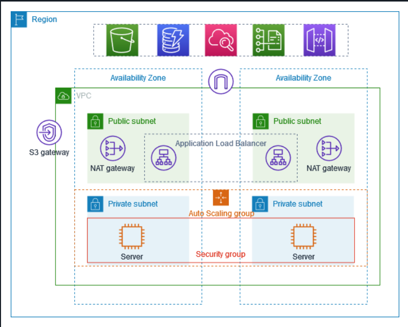

# AWS Secure Infra Project

## 🛡️ Security Overview
This project demonstrates how to deploy a hardened AWS infrastructure using the Principle of Least Privilege.

## 🚀 Implemented Security Controls
* **Identity & Access:** IAM roles with granular permissions (No Root usage).
* **Data Protection:** S3 buckets with "Block Public Access" and AES-256 encryption.
* **Network Security:** VPC designed with Private Subnets and Security Groups restricted to specific IPs.

## 🛠️ Tools Used
* **Terraform:** For Infrastructure as Code (IaC).
* **AWS CLI:** For manual configuration and audits.
* **Checkov/tfsec:** For static analysis security scanning.

## Architecture

This project follows a secure, cloud-native architecture leveraging Amazon Web Services (AWS) to manage identity and data storage.

### 1. Access Control (AWS IAM)
The project utilizes **AWS Identity and Access Management (IAM)** to enforce the principle of least privilege.
- **Identity-Based Policies:** Fine-grained permissions are assigned to IAM users and roles, ensuring that each component only has the access necessary for its specific function.
- **Role-Based Access:** Applications or services (e.g., Lambda or EC2) assume dedicated IAM roles with scoped-down policies to prevent broad account access.
- **Secure Authentication:** Multi-Factor Authentication (MFA) and temporary security credentials (via AWS STS) are prioritized ov:wqer long-term access keys.

### 2. Encrypted Storage (Amazon S3)
Data is stored in **Amazon Simple Storage Service (S3)**, configured with multiple layers of protection:
- **Server-Side Encryption (SSE):** All data at rest is encrypted using either Amazon S3-managed keys (SSE-S3) or AWS Key Management Service (AWS KMS) for enhanced control and auditing.
- **Encryption in Transit:** Secure communication is enforced via TLS (HTTPS), and bucket policies are configured to deny non-encrypted requests.
- **Bucket Security:** Public access is blocked at the account and bucket levels, and S3 Bucket Policies are used to further restrict access to specific VPCs or authorized identities.

<figure>
  
  <figcaption>Figure 1: This diagram illustrates the secure separation between public-facing servers and private data storage in our AWS VPC architecture.</figcaption>
</figure>

